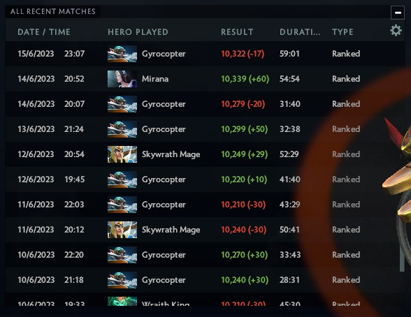

<p align="center">
  

```
  ShowMMR, a DOTA dashboard mod to bring back the mmr numbers now that rank changes are variable
  ------------------------------------------------------------------------------------------------------
  Numbers are displayed like in the old client - the Nov 19 2017 one still works - example: 12345 (+45)
  New numbers are saved locally per-user, serialized to JOY1 - JOY32 binds for up to 640 recent matches
  Your defined binds - that reside in slot0 - will not be affected
  Optionally retrieve previous history via ShowMMR tool, and replace local file with the generated one
                                        _______________________
                        SetTableValue  |                      3|    GetTableValue
                        _______________| scripts /             |____________________
                       |  __>___>___>__  custom_net_tables.txt  ___>___>___>___>__  |
                       |^|             |_______________________|                  | |
                 ______| |_____                                                   |v|
                |             2|         SendCustomGameEvent       _______________| |________________
                | scripts /    |__________________________________|                                 4|
  SendToConsole | vscripts /    ___<___<___<___<___<___<___<___<__  panorama /                       |
   _____________| core /       |                                  | layout /                         |
  |  _<___<___<_  coreinit.lua |          DOTARankUpdated         | dashboard_background_manager.xml |
  | |           |______   _____|   DOTAShowProfileHeroStatsPage   |_______________   ________________|
  | |                  | |               #ranked_mmr_value                        | |
  |v|    LoadKeyValues |^|                                                        |v| core.Data.history
  | |      ____________| |___________                          ___________________| |__________________
  | |     |                         1|                        |                                       5|
  | |_____|  cfg /                   |                        | panorama /                             |
  |____>__   user_keys_%d_slot3.vcfg |                        | layout /                               |
          |__________________________|                        | dashboard_page_profile_recent_game.xml |
                                                              |________________________________________|

  If any game is running, only cached Data history is used when opening the profile page
  Back at dashboard, event signals script to retrieve #ranked_mmr_value and update table if needed
  It may look like a lot of work to just get a number from ui and save it in a table locally
  That is because vscript and panorama are finally hardened / crippled, no more ~arbitrary r/w!

  These scripts do not touch any gameplay elements, should be whitelist-able at a glance
  Knowing Valve have historically disabled specific modding features rather than carpet banning users
  Nothing bad should happen if there is any official griefing regarding this harmless dashboard mod
  Still, use at your own risk!
```
```
  To install the mod:
  - open Steam > Library > Dota2 > right-click Properties > Installed files > Browse..
  - copy release/game/ subfolder over there, overwriting existing files:
  game/dota_mods/pak01_dir.vpk
  game/dota/gameinfo_branchspecific.gi
  - or skip gameinfo_branchspecific.gi and use instead launch option: -language mods

  To remake the mod from source:
  - need Dota2 Workshop Tools DLC for resourcecompile xml source files
  - run dota_mod_builder.bat, auto-compiled vpkmod will create the release vpk archive

  To explore release/game/dota_mods/pak01_dir.vpk and compiled *_c content:
  - use VRF tool by SteamDatabase: github.com/SteamDatabase/ValveResourceFormat/

```
</p>